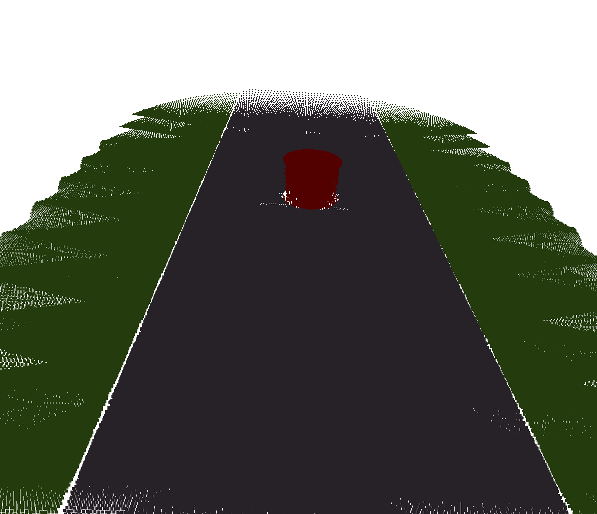
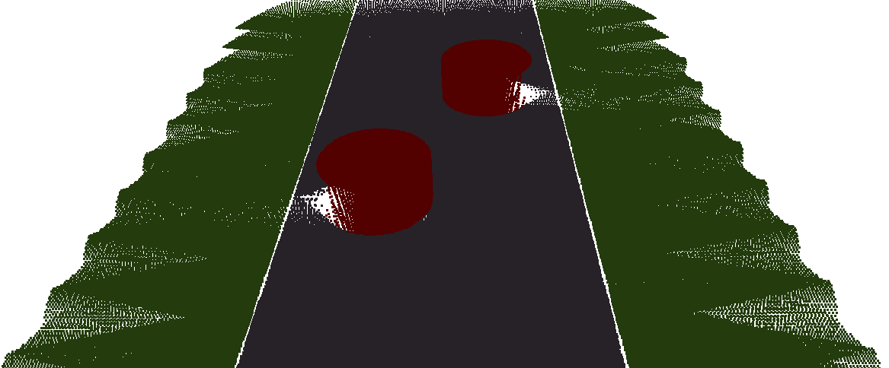
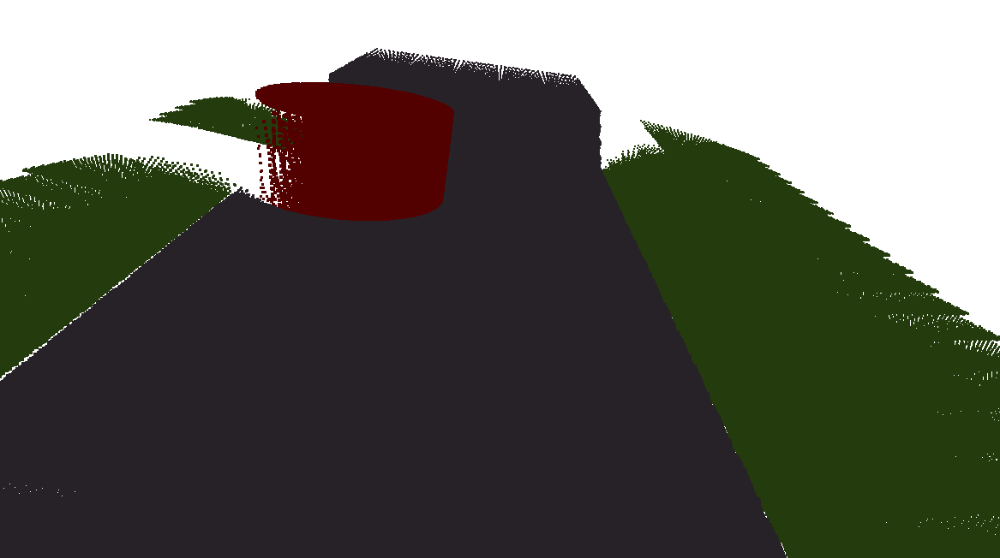
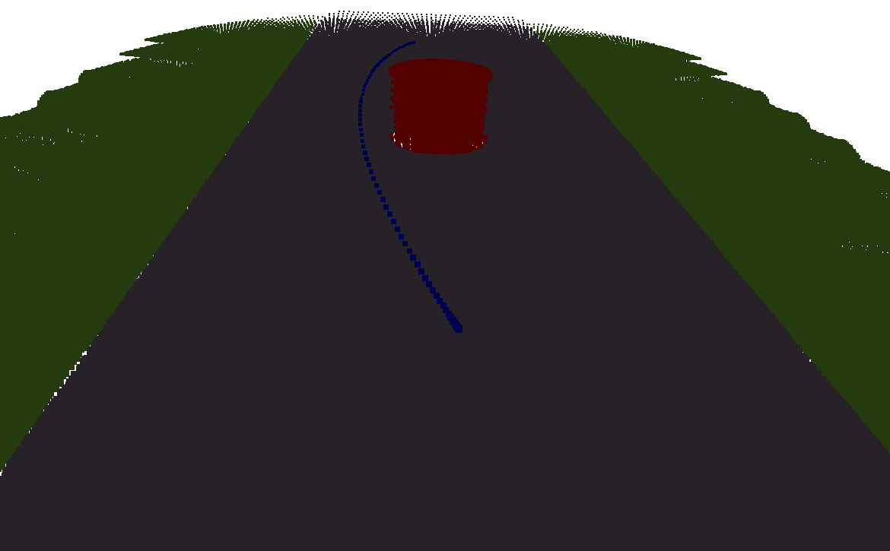
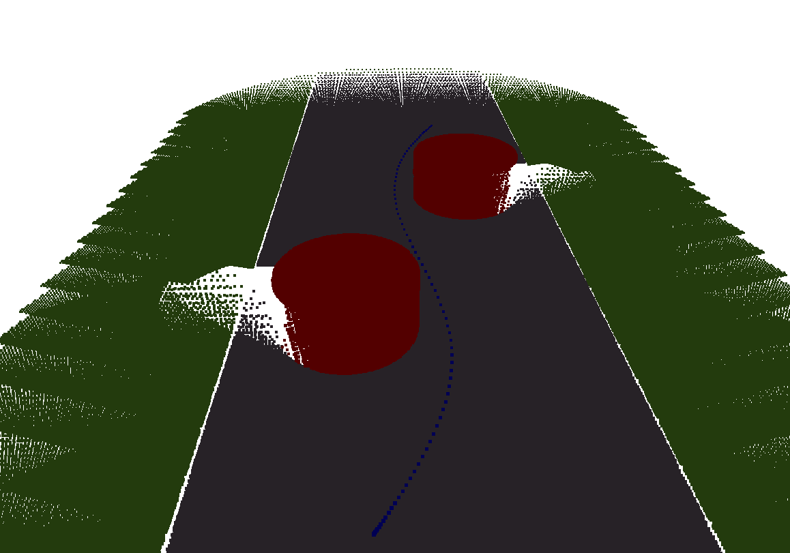
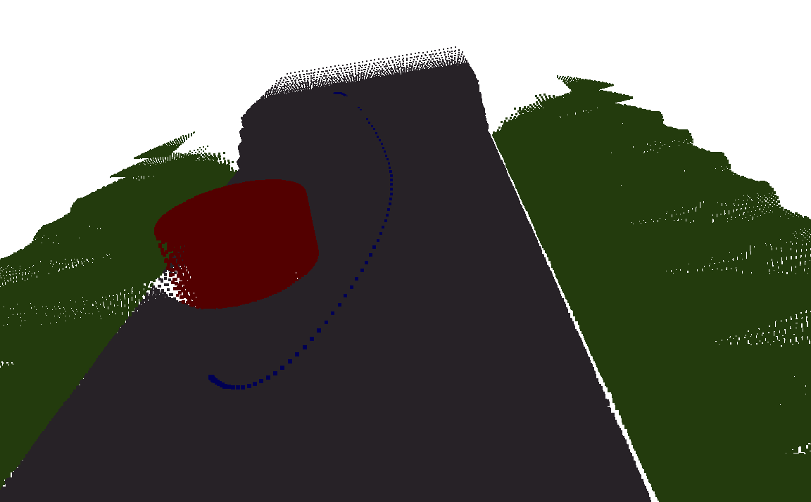
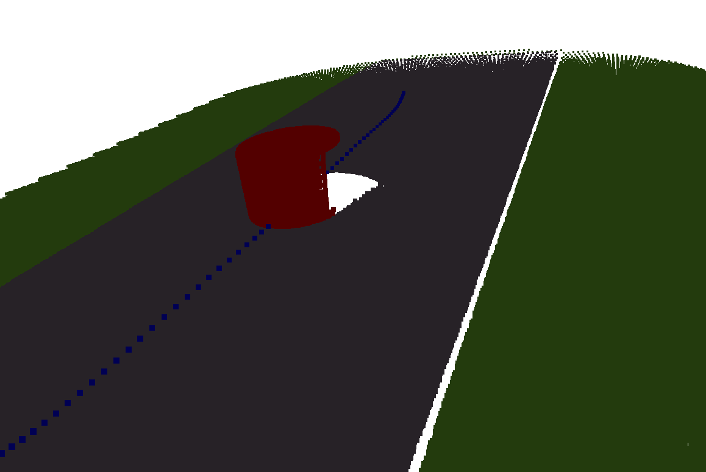
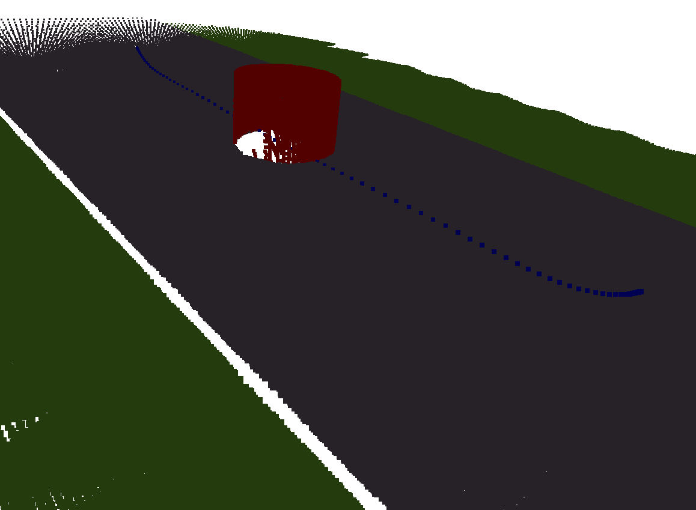
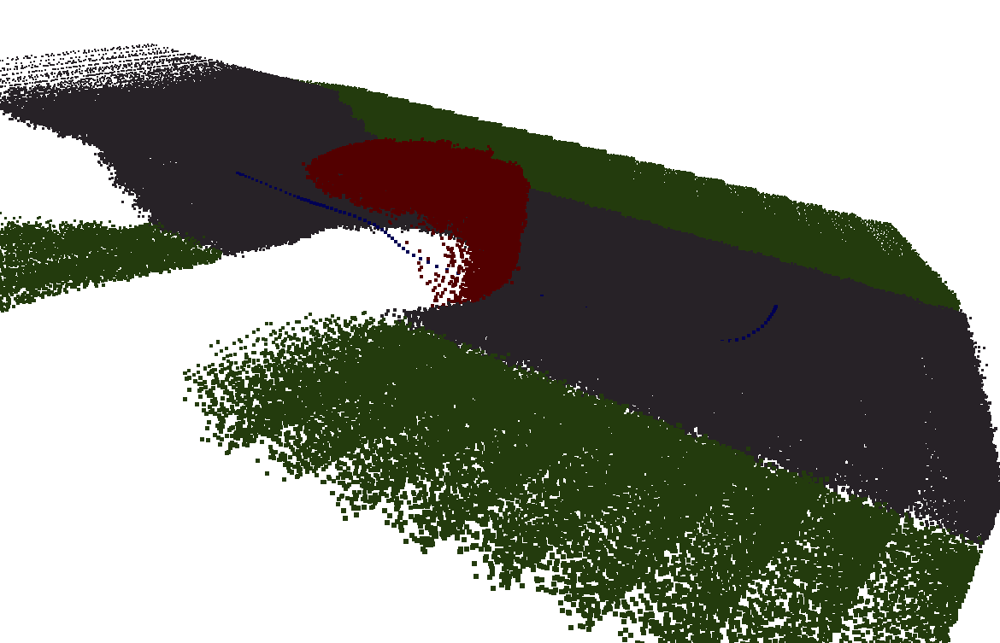

# Trajectory Optimization based Local Planner
3D Voxels and Semantics based continuous time motion planner for Autonomous Driving. Uses 3D pointcloud and segmentation to create Voxels with semantic and TSDF information, and generates Euclidean Sign Distance Fields from TSDF while using it to optimize a ploynomial based trajectory optimization problem. The Geometric data can be obtained using Lidar along with RGB camera images to combine geometric information like mesh and sematic information like lanes, road surface for planning safe and efficient paths.  
## Simulated Scenes
Currently, a few simulated scenarios are provided to emulate a basic on road obstacle scenarios.  
### Simple scenario 
A simple scenario of a single cylindrical obstacle
           in the road center.
 
### Multi-Obstacle scenario
A scenario consisting of two obstacles placed next to each other to evaluate planner turning betwen obstacles.
 
### Sloped scenario
Added a slope to simple scenario to analyze how the planner plans in 3D and above the road surface.
 
## Requirements
The versions tested are specified in braces.
- Eigen3 (3.3.7)
- Protobuf (2.6.1)
- Glog (0.4.0)
- Ceres (1.14.0)
- CMake (3.16.0)

## Instructions - Manual Steps
### Outline
- Generate TSDF layers 
- Convert the TSDF layers
- Visualize the ESDF layers 
- Planning using ESDF Map
>**Note**  
>CMake Targets for the above specified programs are provided in the CMakeLists.txt

### Steps
#### TSDF Generation
A point cloud is generated by moving camera through the scene and incrementally integrating the point cloud while populating voxels with TSDF values.
The TSDF layers would be saved at the path specified as argument for both obstacles and drivable zone.
 
Usage: `generate_tsdf <scene> <output_obstacles_layer> <output_drivable_layer> <output_pointcloud>`
 
For example `generate_tsdf tsdf_obstacles_layer.layer tsdf_free_layer.layer pointcloud.txt`
 
**scene**  Scenario for mapping. Choose from the scenarios mentioned in last step.
 
**output_obstacles_layer** Path to load the TSDF layer for driving zone
 
**output_drivable_layer** Path to load the TSDF layer for obstacles
 
**output_pointcloud**  Path to save the coloured point cloud as txt file as [XYZRGB]
#### ESDF Generation from TSDF
Once we have a TSDF map for a scene, ESDF map is generated from it and saved at the path provided. Along with the TSDF layer input, you need to specify 
the category of the ESDF map. i.e whether the maps is for obstacles or drivable zone. For obstacles the road surface is masked (using the pointcloud semantic label)to prevent it to be considered it as an obstacle.
 
Usage: `esdf_from_tsdf <input_layer> <output_layer> <category>`
 
For example: `esdf_from_tsdf tsdf_obstacle_layer.layer esdf_obstacle_layer.layer obstacle`
 
Here the esdf_from_tsdf is the generated executable.

#### ESDF Voxel Visualization
ESDF voxel generated can be visualized as colored point cloud as heatmap range from Red to Green. The Red denotes
the high value of costs which are penalized by the optimizer while green indicate the zone with minimum costs. For obstacles the Red areas are near obstacles or very near to obstacles, yellow near to obstacles and green is the free space.  
For drivable zones, the road surface is color denoted as green while area above or gar from road surface is indicated as yellow or red based
on its distance from road surface. practically, it ensures the path planned stays on road surface and penalized the height from road surface.
 
Usage: `visualzie_esdf_voxels <input_layer_path> <layer_category>` 
 
Where <input_layer_path> is the path of TSDF layer generated in last step and <layer_category> indicates the semantic category of the map. i.e obstacles or free space.
 
For exampe to save ESDF map for obstacles use : `visualzie_esdf_voxels esdf_free_layer.layer free` and
similarly for drivable zone use : `visualzie_esdf_voxels esdf_obstacle_layer.layer obstacles`
 
>**Note**  
>A colored pointcloud (XYZRGB) with voxel centers would be saved as layer_name_pointcloud.txt (e.g esdf_obstacles_layer_pointcloud.txt) .

#### Planning
After constring ESDF maps for both obstacles and Drivable area, we can use the distance information in the map to calculate potential fields indicating collision and road surface deviation costs and solve the optimization problem to find the trajectory polynomial minimizing these costs.

## Scripts (For Linux)
Below you can find scripts to build and perform all the steps define in the above manual steps.
### Code compilation
A script to complie the code using cmake is provided in scripts directory.
`bash scripts/compile.sh`
### Execution
Script are provided for each scenario. The planned path (highlighted over scene) is saved as colored point cloud [XYZRGB format] in the output directory along with esdf layer pointclouds for obstacles, drivable zone. 
`bash scripts/simple-scenario.sh`
 
`bash scripts/multi-scenario.sh`
 
`bash scripts/slope-scenario.sh`

#### Output
For each scenario, following output files are generated.

- output/pointcloud_scenario.txt where scenario can be [simple, multi, slope]
    - Output point cloud
- output/esdf_obstacles_layer_pointcloud.txt
    - ESDF layer for obstacles saved as colored heatmap  point cloud
- output/esdf_free_layer_pointcloud.txt
    - ESDF layer for drivable space saved as colored heatmap  point cloud
- output/pointcloud_scenario_plan.txt
    - Planned path highlighted over the scene point cloud
### Planner Details
A document describing the planner (planner.pdf) contains the derivation for the planner.

## Results
### Simple Scenario

### Multi Scenario

### Slope Scenario

## Limitations
### Planning directly through center of obstacles

 
**Fix (shown in blow image)** Use multiple views from camera to prevent blind spots so that corners of obstacles have non empty esdf map.
Sometimes planner still goes through the obstacles as a compromise between smoothness costs and collision costs as it picks a colliding path over non smooth collision free path as show below.

 
**Note**Smaller on the side of obstacle.
### Noise + Large unknown areas, holes in TSDF/ESDF maps

